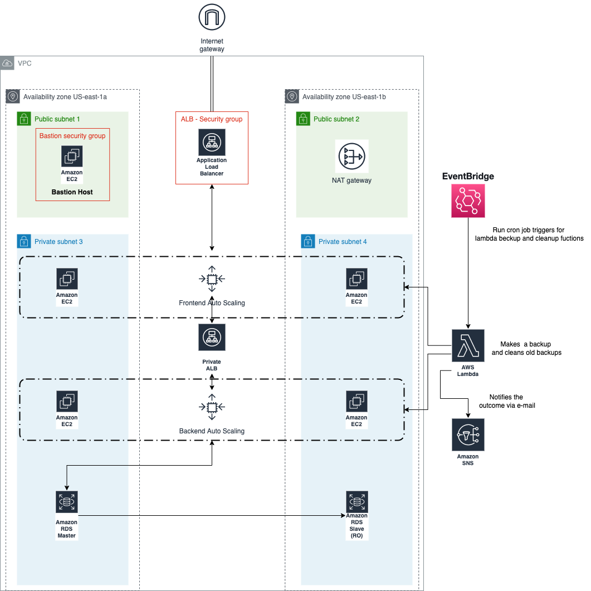

## _Demonstration/exercise_ project for AWS, Lambda, Python, Go, Terraform, and more


#### This project is using  public AWS modules from the Terraform Registry for infrastructure shown in the diagram below. GitHub Actions is used to compile new committed script code to S3. Terrateam is used to deploy new IaC changes


AWS services used:
* VPC
* S3
* RDS
* ASG
* EC2
* Lambda
* EventBridge

Scripts used for Lambda:
* Python (up-scaling and downscaling, AMI cleanup)
* Go (AMI backup)




#### Usage on a different AWS account:

* Clone this repo
* Add the following secrets to your GitHub repo:
  * **AWS_ROLE** - This is an IAM role that has permissions to deploy any of the resources in this project including IAM roles and policies with **_Terrateam_**.
    * Example : `arn:aws:iam::123456789012:role/terraform`
      * Trust Policy Example:
```json

{
    "Version": "2012-10-17",
    "Statement": [
        {
            "Effect": "Allow",
            "Principal": {
                "Federated": "arn:aws:iam::062791981969:oidc-provider/token.actions.githubusercontent.com" #This is the GitHub Actions OIDC provider
            },
            "Action": "sts:AssumeRoleWithWebIdentity",
            "Condition": {
                "StringLike": {
                    "token.actions.githubusercontent.com:aud": "sts.amazonaws.com",
                    "token.actions.githubusercontent.com:sub": "repo:miloszizic/*:*" #This is the GitHub repo name
                }
            }
        }
    ]
}
  ```
  * **_AWS_ROLE_S3_** - This is an IAM role that gives GitHub actions permission to upload and host lambda functions.
  It also needs trust policy as the **_AWS_ROLE_**.

  * **_S3_BUCKET_** - This is the name of the S3 bucket that will be used to store the lambda functions.
* Now every time you make a PR to the master breanch, Terrateam will run a plan and apply on comment `terrateam apply` in PR . Changes in the `scripts` directory will be compiled and uploaded to S3 with other GitHub action.

**_Note_** : Only changes to terraform code will trigger Terrateam. Changes to `scripts` will only trigger GitHub action.

#### TODO:
* Add more infrastructure to get more hands-on experience with AWS resources.
* Add aquasecurity/tfsec
* Use Terragrunt to make the project more modular and DRY.
* Add more documentation.
